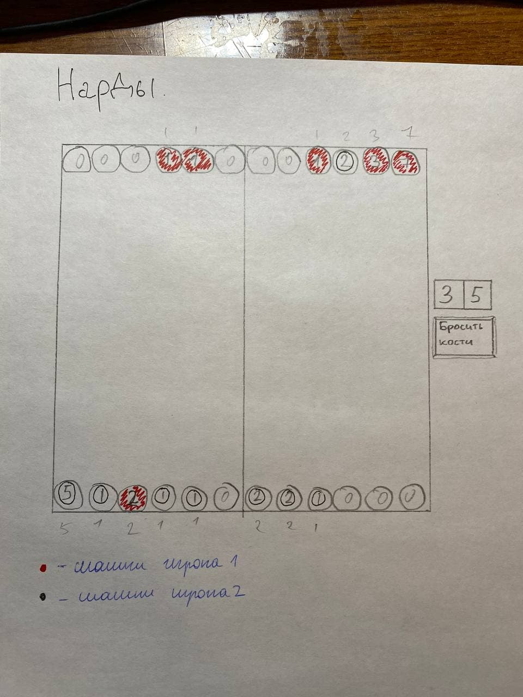

# Нарды

## Постановка задачи
Реализовать поле для игры в нарды. GUI framework -- tkinter. Ходить можно будет по очереди, то черными, то белыми. Сначала нужно нажать на поле, откуда ходить, потом куда ходить. Одна шашка будет передвинута, если такой ход возможный. Если ход невозможный, то программа не даст его сделать. Если кто-то выиграл после своего хода, программа поздравит победителя и закончит игру. 

## Интерфейс
Каждая ячейка будет реализована в виде кнопки. На ней будет написано количество фишек и цветом кнопки показано, какие фишки на ней стоят. 

